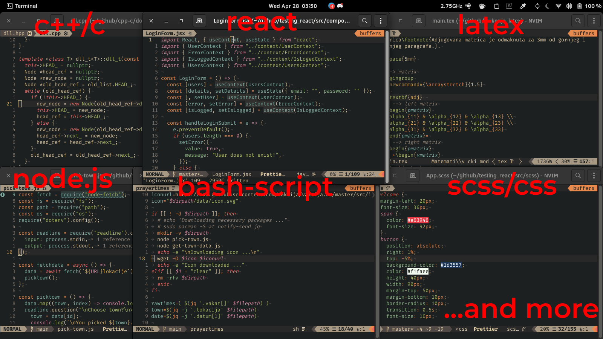

# Neovim configuration

Neovim config files and plugins with [neoclide/coc.nvim](https://github.com/neoclide/coc.nvim)



## How to install?

Make sure first you install [junegunn/vim-plug](https://github.com/junegunn/vim-plug)

```
sh -c 'curl -fLo "${XDG_DATA_HOME:-$HOME/.local/share}"/nvim/site/autoload/plug.vim --create-dirs \
       https://raw.githubusercontent.com/junegunn/vim-plug/master/plug.vim'
```

then clone this repo to `~/.config/nvim` and install plugins

```
git clone https://github.com/hllvc/nvim.git ~/.config/nvim; \
nvim +PlugInstall +qa
```

If you want my custom snippets execute following command

```
mv ~/.config/nvim/ultisnips ~/.config/coc/
```

otherwise

```
rm -rf ~/.config/nvim/ultisnips
```

to delete ultisnips directory and

```
rm -rf ~/.config/nvim/images
```

to delete images directory.

#### Maybe for some plugins to work additional packages need to be downloaded.
